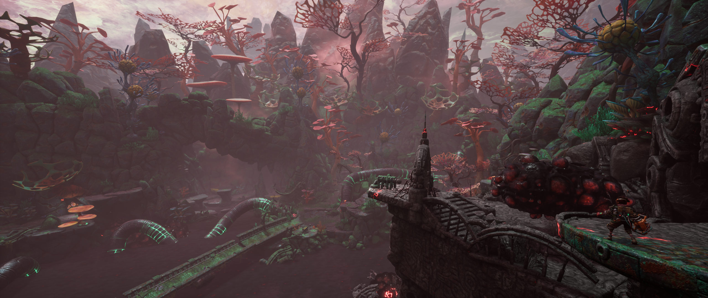

## The Gunk ultrawide and wider

The tool corrects the field of view decrease affecting 21:9 and wider resolutions, and removes the side black bars from the cutscenes.

1. [Download](/../../releases) and unpack the archive.
2. Launch the game first, followed by the tool.
3. Press the hotkey as instructed.

All trainers based on CE components may trigger some anti-virus software.

Tested on the latest Microsoft Store version at 2560x1080, briefly at 3840x1080 and 5760x1080. There may be some native camera issues at the latter.

You can buy me a [coffee](https://ko-fi.com/rozziroxx) or become a [patron](https://www.patreon.com/rozzi).

